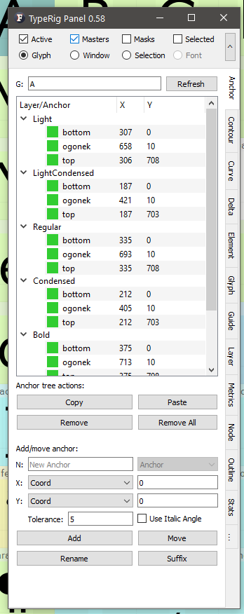
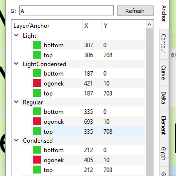
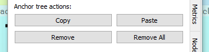
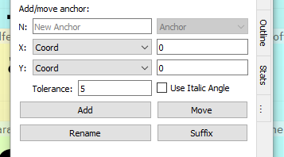
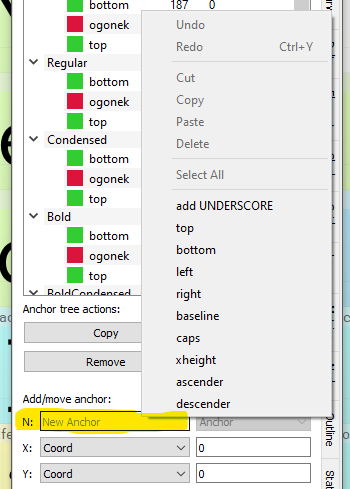
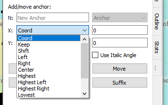
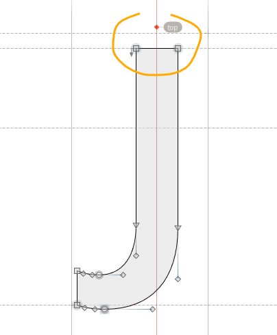
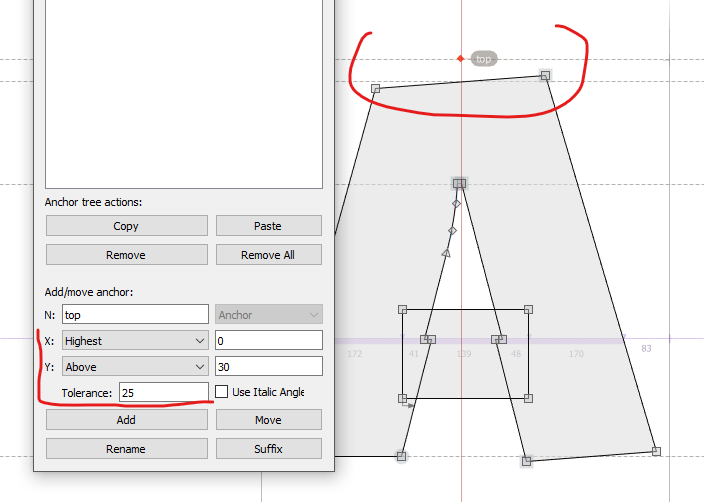
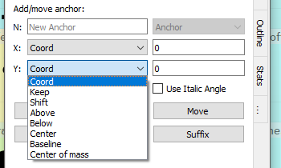

# TypeRig GUI 

## TypeRig Panel

### Anchor Panel
The Anchor tab/subpanel is a special purpose tool for dealing with anchors on glyph level. It works in Glyph Window (GW) as well as Font Window (FW) and most of its actions are governed by the TypeRig panel masthead (MH) unless specially noted. Use _Refresh button_ when moving onto another glyph. Trying to apply any action onto different glyph than the one shown will discard that action, rise a warning and refresh the panel. The Anchor tab consists of three main sections: anchor tree; anchor tree actions; Add/move/modify anchor;

_A typical view of Anchor panel_

#### The Anchor tree
The Anchor tree shows all of the glyph's master layers and their associated anchors in a spreadsheet like view. Anchors that are compatible (present) in all of the masters are marked green, those that are missing in one or several layers are marked red. 

_A typical view of Anchor tree with some anchors missing_

Fields showing anchor position across layers are editable and upon entry **will change** the coordinates of the anchor modified.

#### The Anchor tree actions

This part represents some basic actions:
- **Copy**: Will copy the selected anchors in memory so that they can be pasted/inserted into another glyph. Anchors are organized per layer. The action will not allow copy and pasting anchors between layers;
- **Paste**: Will paste the anchors found in memory into another glyph;
- **Remove**: Will remove the selected anchors in Anchor tree;
- **Remove All**: Will remove all anchors according to panel MH. For example running the action with _Active Glyph_ selected in MH will delete the anchors in the current active layer, while having _Masters_ selected in MH will delete all anchors on all masters.

#### Add/move/modify anchor
This part is responsible for creating, moving and renaming anchors.

_An overlook of the Add/move/modify anchor part_

On top left resides an editing field (N:) for entering anchor name. It is used in new anchor creation as well as for renaming or adding suffix to existing ones. It also offers some common naming options upon right click. Right next to it is a combo box that allows switching between Anchors and Pins.

_Right click options of the Anchor name-filed_

Below are two combo boxes that are responsible for the anchor position. Next to each combo box is an editing field that offers further adjustment to the algorithm chosen.

_X positioning options_

The **X position** box currently offers the following:
- **Coord**: Will set the X coordinate of the anchor at exactly the coordinate entered in the editing field next to it;
- **Keep**: Will keep the current coordinate of the anchor if modifying/moving an existing anchor;
- **Shift**: Will move the anchor from its current position by (+/-) units entered in the field. _Example: Shift -10_
- **Left**: Will move the anchor from its current position or create new one to the left of the outline Bounding box (BBox). Use editing field to add or subtract units (+/-) from that position; _Note: In all of the following modes Editing field behaves as mentioned here!_
- **Right**: Will move the anchor from its current position or create new one to the right of the outline BBox;
- **Center**: Will move the anchor from its current position or create new one to the geometric center of the outline BBox;
- **Highest**: This algorithm will measure the topmost flat part of the outline and return it's center. If there is a single node residing there it will return the coordinates of that node (ex. /O, /C, /o, /c /e and etc. ). If there are multiple nodes it will return the middle of that measured section. There is a editing field below named _Tolerance_ that controls what the algorithm considers to be a "flat" part of the outline measured. For instance if you have an inclined apex on /A - _tolerance_ of 0 will return the coordinates of the tompost point of it, while _tolerance_ equal or greater then the height of that design feature will consider it "flat" and return the center of it.
- **Highest Left**: Will do as explained above but will return the leftmost coordinate of the feature in question;
- **Highest Right**: Will do as explained above but will return the rightmost coordinate of the feature in question;
- **Lowest**: Will behave the same way as _Highest_ setting but for the lowest part of the outline;
- **Lowest Left**: Same as its Highest counterpart but for the lowest part of the outline;
- **Lowest Right**: Same as its Highest counterpart but for the lowest part of the outline;
- **Center of mass:** Will make a statistical measurement of the mass distribution of the outline design (positive vs negative space) and return its [center of mass](https://en.wikipedia.org/wiki/Centroid) accordingly. 

X positioning Using **Highest** setting

X positioning Using **Highest** setting _top_ (green), **Highest Right** _caron_ (yellow) and **Lowest** _bottom_ (blue)

X positioning Using **Highest** setting with _tolerance_

The **Y position** box currently offers the following:
- **Coord**: Will set the Y coordinate of the anchor at exactly the coordinate entered in the editing field next to it;
- **Keep**: Will keep the current coordinate of the anchor if modifying/moving an existing anchor;
- **Shift**: Will move the anchor from its current position by (+/-) units entered in the field. _Example: Shift -10_
- **Above**: Will move the anchor from its current position or create new one to the top of the outline BBox;  Use editing field to add or subtract units (+/-) from that position; _Note: In all of the following modes Editing field behaves as mentioned here! Example: 'Above' 30 will measure 30 units from the top of BBox_
- **Below**: Will move the anchor from its current position or create new one to the bottom of the outline BBox; 
- **Center**: Will move the anchor from its current position or create new one to the geometric center of the outline BBox;
- **Baseline**: Will use the Baseline _(Y = 0)_ as measure;
- **Center of mass:** Will make a statistical measurement of the mass distribution of the outline design (positive vs negative space) and return its [center of mass](https://en.wikipedia.org/wiki/Centroid) accordingly. 

_Y positioning options_

**Add** button will add/create the desired anchor in accordance to current option selected in MH. If anchor with the same name already exists, FL will rename the existing anchor with numeric index as suffix (ex. top.1).

**Move** button will move one or more anchors selected in **Anchor Tree** in accordance to current option selected in MH. _Note that it will not take into consideration on which layer in Anchor Tree the anchor was selected it only takes options of MH. It will only use the name of the anchor!_

**Rename** will rename the selected anchor taking a new name from the name field in accordance to current option selected in MH.

**Suffix** will add suffix to the names of selected anchor(s) taking the suffix string from the name field. This action i processed as well in accordance to current option selected in MH.