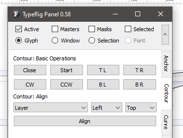
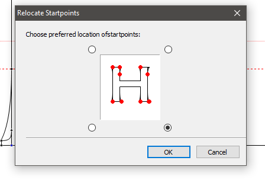
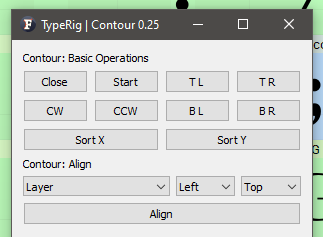
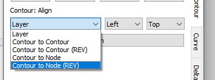

# TypeRig GUI 

## TypeRig Panel

### Outline Panel
The Contour tab/subpanel is a special purpose tool dealing with some contour operations in Glyph Window (GW). Its actions are governed by the [TypeRig panel masthead (MH)](https://kateliev.github.io/TypeRig/Docs/GUI/TR-Panel-Basics).

_A typical view of Contour panel_

#### Basic operations
In this section reside several buttons covering the following basic operations in accordance to layer options selected in MH:
- **Close**: Will close a selected open contour;
- **Start**: Will set a selected node as a star node;
- **CW**: Will set the contour direction to Clockwise _(TrueType direction)_;
- **CCW**: Will set the contour direction to Counterclockwise _(PostScript direction)_;
- **TL**: Sets the contour start node to the node that has most **Top Left** coordinates;
- **TR**: Sets the contour start node to the node that has most **Top Right** coordinates;
- **BL**: Sets the contour start node to the node that has most **Bottom Left** coordinates;
- **BR**: Sets the contour start node to the node that has most **Bottom Right** coordinates;

_Relocate start point in FontLab Studio 5_

Note: Actions performed by **TL, TR, BL, BR** buttons are similar to the _Relocate start points_ command in FontlabStudio 5

_New in Contour Panel v0.25 - Reorder Contours_

- **Sort X** - Will rearrange the order of contours based on their BBoX X coordinate.
- **Sort Y** - Will rearrange the order of contours based on their BBoX Y coordinate.

#### Align

This section offers some contour to contour alignment options that work in accordance to layer options selected in MH. Except explicitly noted, contours that will be aligned should have at least one node selected _(it is not necessary to select whole contours)_. 

_Contour alignment modes_

Currently the supported alignment modes  are as follows:
- **Layer** - Will align **all** contours at every layer. _No selection needed!
- **Contour to contour**: Will align selected contours in normal order. _Please note that all contours will be aligned to the one that sits at the bottom of the contour list in FL Elements panel. Regretfully it is not possible to take the order of selection as alignment basis._
- **Contour to contour (REV)** : Will align selected contours in reversed order. _Please take into consideration the above explanation._
- **Contour to Node**: Will align a contour to a node selected in normal order._It requires only two nodes to be selected - one that will suffice for marking the whole contour and second for the target of alignment. Contour order still matters as already explained above. It is best suited for aligning a single  contour to a single node. Also please note that the position of a contour alignment depends on the options chosen in combo boxes next to the mode menu. For instance if Left + Bottom are selected then the Left Bottom point of the contour bounding box (BBox) will be aligned to the node selected, but if Top Right are chosen then the Top Right BBox of the contour will be aligned to the node of interest._
- **Contour to Node (REV)**: Will align a contour to a node selected in reversed order. _See above!_

**Panel development notes**
- Stability: Normal - no known major issues.
- Development priority: Low/Planned - not likely to be changed often, but quite few changes are planned for future releases.
- Future improvements: For now this is kind of bare-boned tool that has a lot of room for expansion. User requests are welcome!
