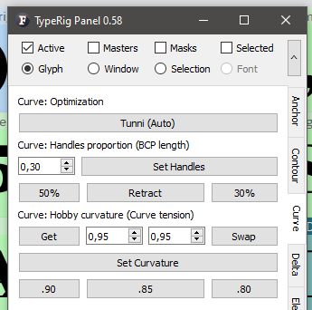

# TypeRig GUI 

## TypeRig Panel

### Curve Panel
The Curve tab/subpanel is a collection of special purpose tools providing some curve optimizations in Glyph Window (GW). Its actions are governed by the [TypeRig panel masthead (MH)](https://kateliev.github.io/TypeRig/Docs/GUI/TR-Panel-Basics).

_An overview of Curve panel_

**Optimization**
Will perform a Tunni optimization of the selected curve segments. Algorithm is based on the work of Eduardo Tunni and is similar to the one provided with FontLab, except it can work on multiple layers simultaneously, but will have hard time with curves having inflection(s) as well as flat curves.
_Recommended use: Will result some nice smooth curves. FL internal tools are better, but the lack of multi layer support might be a deal-breaker that creates a niche for such tools._

**Handles proportion**
Gives control over the length of the curve BCPs in comparison to curve chord length. _Set handles button_ together with spinbox on the left allows setting of an arbitrary proportion for both handles. Buttons below provide some preset proportions commonly used. _Retract button_ will place off-curve points over the same coordinates of their parent on-curve points similar to _Retract BCP_ in FotlabStudio 5.
_Recommended use: Might fix some interpolation kinks by setting BCP proportions equal on layers selected. Retract is useful in ink-trapping as well as curve flattening._

**Hobby curvature**
Allows controlling the selected curve shape by its tension parameters according to John Hobby Metafont/Metapost algorithm. The two central spinboxes set curve tension for inbound (left filed) and outbound (right field) nodes. The _Get button_ will extract those values from a selected curve. _Swap button_ will swap values if needed. Buttons below will set the curvature to the tensions chosen or to three predefined commonly used settings.
_Recommend use: Does miracles most of the time in the hands of experienced user. Also might offer slight optical correction for slanted shapes._

**Panel development notes**
- Stability: Normal - no known major issues. Several minor issues with inflections, flat curves or trying to process lines instead of bezier curves with hobby algorithm. 
- Development priority: Low - not likely to be changed often, most issues will be fixed someday.
- Future improvements: It seems that new exciting algorithms are popping every year, most of them will be adopted in future...
