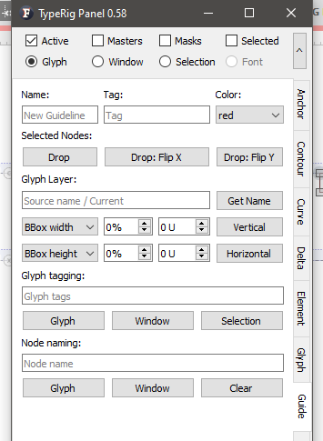
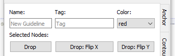
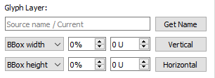

# TypeRig GUI 

## TypeRig Panel

### Guide Panel
The Guide tab/subpanel is a special purpose tool dealing with guidelines in Glyph Window (GW). Its actions are governed by the [TypeRig panel masthead (MH)](https://kateliev.github.io/TypeRig/Docs/GUI/TR-Panel-Basics).

_An overview of Guide panel_

The panel is split into multiple sections each with its own special functionality.

**Selected nodes**

_Section for creating new guidelines using nodes selected._

The very first section contains some basic fields for choosing guideline name, tag and color. These work together with _Selected nodes_ section that offers the following functionality:
- **Drop**: will create guideline between any two selected nodes (including handles) or a vertical guideline trough a single selected node; _Its operations (ass well as all buttons below) are governed by the TR panel MH, meaning that the new guideline that will pass trough nodes selected will be created for all compatible nodes on all layers chosen in MH._
- **Drop: Flip X**: will create new guideline with the same behavior explained above but flipped horizontally;
- **Drop: Flip Y**: will create new guideline with the same behavior explained above but flipped vertically.

**Glyph Layer**

This section deals with guideline creation based on some glyph/layer/font parameters - bounding box (BBox) width and height as well as glyph advance and font wide parameters such as caps-height, x-height and etc. All operations affect only the currently active glyph in GW/FW. 

_Creating new guidelines based on glyph/layer parameters._

- **Source field** + **Get Name**: the editing field allows you to manually select the "source of measurement". If left black (default) all measurements are done on the current active glyph. _Get Name_ button will populate the editing field with the name of the currently selected glyph in GW/FW;
- **Vertical guideline** _(row)_: create a new vertical guideline according to a percent + adjustment (in units) of measured _BBox_ or _advance width_ of the glyph specified in the _Source field_; _Very useful for superimposing the width of another glyph (with some adjustment) to the currently designed one. For example you want to have a guideline on all layers that marks a 90% of the BBox width of a /H -15 units, while drawing an /E._
- **Horizontal guideline** _(row)_: offers the same functionality as explained above but for horizontal guidelines. Available options here include all vertical font metrics and advance height.

Please not that all newly created guidelines are named according to the source chosen and measurement + adjustment used. All measurements are done per layer (controlled by MH).

**Glyph Tagging**

_Glyph and node naming/tagging_

Will create/add new glyph tag to:
- currently active **Glyph**,
- all glyphs in current active text **Window**,
- all glyphs **Selected** in font window.

**Node naming**
Will tag/name all nodes selected in:
- currently active **Glyph**,
- all glyphs in current active text **Window**;
- or will **Clear** exiting tag/name.

**Panel development notes**
- Stability: Normal - no known major issues. 
- Development priority: Low - not likely to be changed often.
- Future improvements: Guideline recipes as soon as they become available in FL API.
