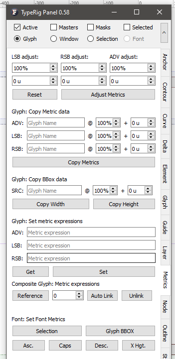
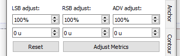
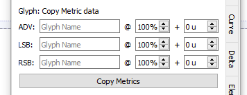
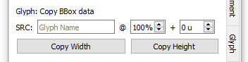
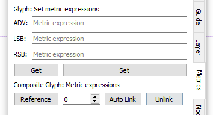
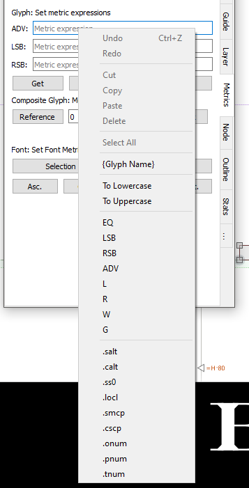
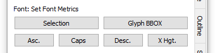

# TypeRig GUI 

## TypeRig Panel

### Metrics Panel

The Metrics tab/subpanel is a special purpose tool dealing with glyph and font metrics. Its actions are governed by the [TypeRig panel masthead (MH)](https://kateliev.github.io/TypeRig/Docs/GUI/TR-Panel-Basics). This means that all operations provided could be done on numerous selected layers and glyphs simultaneously.  

_An overview of the Metrics panel_

The panel is split into multiple sections each with its own dedicated functionality.

**Metrics adjustment**

_Metrics adjustment options_

This section allows adjusting Left (LSB) or Right (RSB) sidebearing as well as advance width (ADV) within given ratio (percent) from current value plus some distance in units.

**Glyph: Copy Metric data**

_Copy Metrics section_

This is a tool for copying metric values from another glyph with adjustments in ratio (percent) and some distance (units).

**Glyph: Copy BBox data**

_Tool overview_

This special purpose tool will shift all selected nodes in current GW at position corresponding to some Bounding box (BBox) value of a source glyph given. _For example lets imagine that you want to have an /E that is 80% + 5 units of the width of /H. You could select the outermost points on the hands of the /E including serifs an all other detail that you want shifted. Then the tool will calculate the BBox of the selection and fit its rightmost boundary within the source BBox with adjustment values given. Same goes for height - you could easily shift the upper parts of a /d ascender to be 100% + 25 units of the height of an /H. The tool is also very useful for size fitting all sorts of dashes, arrows and other symbols._

**Glyph: Set Metric Expressions**

_Set metric expressions tool_

This section deals with setting or modifying metric expressions of one or multiple glyphs. Usage is pretty self-explanatory. _Get_ button will fetch the expressions of the current active glyph while _Set_ will set them depending on the MH mode selected. Upon right click each editing field offers a rich set of additional options that will aid you in preparing the metric expressions.

_Set metric expressions tool - right click options_

_For instance lets imagine that you have an expression in LSB field that reads "c". If you right click and select "To Uppercase" the text in the editing field will change to "C". Then if you choose ".smcp" you will add a suffix to current string and get "C.smcp". Then if you click on "RSB" the string will read "=rsb('C.smcp')"... and so on..._

**Composite glyph: Metric expressions** is a sub tool that will auto build your metric expressions by reading Element reference data if it is present.

**Unlink** button will remove all expressions for one or multiple glyphs. _Same effect could be achieved by running the above tool with empty fields._

**Font: Set Font Metrics**

_Set font metrics tool_

This is a special purpose tool for setting font metrics by data found in the current active glyph. It has two rows:
- One for choosing the data source, where **Selection** button will take the coordinate value of currently selected node or **Glyph BBox** that will use the outline bounding box as a reference;
- The second for font metric data that has been set.

_For example imagine the following - you have redrawn a base glyph that would dictate a change of one or more of the font metrics (for example an /n). If you select the node(s) that should be on x-height and click "Selection" + "Xhgt." the font metric in question will be relocated to the node of interest. This is done to all layers selected in MH so metrics on all layers will be changed in accordance to compatible nodes found on the other layers._

**Panel development notes**
- Stability: Normal - no known major issues. 
- Development priority: Low - not likely to be changed often.
- Future improvements: Not planned.
