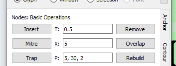
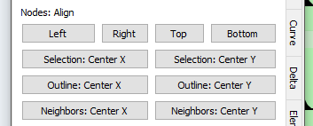
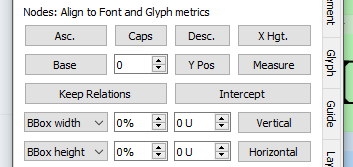
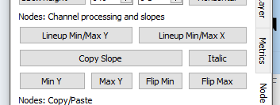
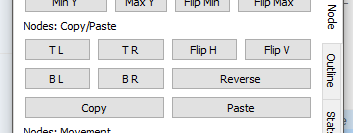

# TypeRig GUI 

## TypeRig Panel

### Node Panel
The Node tab/subpanel is a special purpose tool for dealing with outlines in Glyph Window (GW). All of its actions are governed by the [TypeRig panel masthead (MH)](https://kateliev.github.io/TypeRig/Docs/GUI/TR-Panel-Basics).

_A typical view of Node panel_

#### Nodes: Basic operations

_Basic operations section of Node panel_

This section offers the following tools:
- **Insert**: Will insert a node after the currently selected one at time **T**_(set in the editing field next to the button)_;
- **Remove**: Will remove a the currently selected node;
- **Mitre**: Will create a corner miter at the currently selected node with length **X** _(set in the editing field next to the button)_;
- **Overlap**: Will create a corner overlap (knot) at selected node with length **X** _(set in the editing field before to the button)_;
- **Trap**: Will create an ink-trap at the currently selected node with parameters **P** - a comma separated list containing incision into glyphs flesh, side depth and trap bottom size;
- **Rebuild**: Will rebuild any _structure_ into a proper corner. Requires all nodes that should collapse into a corner to be selected. _For example will rebuild a mitered corner or an ink-trap_.

#### Nodes: Align

_Node alignment operations section of Node panel_

- **Left**: Will align all selected nodes to the leftmost node in selection;
- **Right**: Will align all selected nodes to the rightmost node in selection;
- **Top**: Will align all selected nodes to the highest node in selection;
- **Bottom**: Will align all selected nodes to the lowest node in selection;
- **Selection: Center X**: Aligns to the X center of all selected nodes;
- **Selection: Center Y**: Aligns to the Y center of all selected nodes;
- **Outline: Center X**: Aligns to the X center of the whole outline;
- **Outline: Center Y**: Aligns to the Y center of the whole outline;
- **Neighbors: Center X**: Aligns each selected node to the X center of its neighboring nodes _(prev node + next node)_;
- **Neighbors: Center Y**: Aligns each selected node to the Y center of its neighboring nodes _(prev node + next node)_.

#### Nodes: Align to Font and Glyph metrics

_Advanced alignment options with Node panel_

This section allows alignment of selected nodes to known glyph and font metrics. In addition to the TR Masthead control options there are two more special modes:
- **Keep relations**: Allows for keeping the relations between all selected nodes. _For example selecting all nodes that make the horizontal stem of an /H and clicking "Caps" will move the selected nodes keeping the stem in tact until its upper part is aligned with Caps Height thus transforming the /H into /Pe-cyr_;
- **Intercept**: Will extend any selected node until it intercepts the desired metric target. _Imagine just deleting the serif of the /K's leg. Clicking "Base" with this option active will extend the leg until it reaches the baseline_;
- **None of the above**: All nodes will be just shifted to the desired position.

Alignment options are:
- **Asc.**: Ascender position;
- **Caps**: Caps height position;
- **Desc.**: Descender position;
- **X Hgt.**: X-height;
- **Base**: Baseline;
- **Y Pos**: Will align to any Y position specified with the spin-box before the button;
- **Measure**: Will align to the Y position of the measurement line.
- **Vertical** _(row)_: Aligns to a percent + adjustment (in units) of measured _BBox_ or _advance width_ of the currently active glyph;
- **Horizontal** _(row)_: offers the same functionality as explained above, but for _BBox height_, _vertical font metrics_ and _advance height_.

#### Nodes: Channel processing and slopes
This toolset offers some channel processing instruments as well as various tools for copy/pasting of outlines slopes all synchronized across layers selected in TR Masthead.

_Channel processing and slope tools of Node panel_

- **Lineup Min/Max Y**: Will align all selected nodes on a imaginary straight line that passes between those two of them that have minimum and maximum Y coordinates;
- **Lineup Min/Max X**: The same as above but for minimum and maximum X coordinates;
_Usage example: Chanel processing of scanned graphics or noisy outlines. Removing rough (raw) effects from straight lines. Aligning nodes of where horizontal stems meet with inclined ones (like horizontal of an /A). Repairing misaligned nodes after slant and etc._
- **Copy slope**: Copy the slope between any two selected nodes into memory;
- **Italic**: Set the slope in memory equal to that of font italic angle;
- **Min Y**: Will paste the slope in memory to current selection so that all nodes selected will align on an imaginary ray starting from the node with minimum Y coordinate;
- **Min X**: same as above but from the node with maximum Y coordinate;
- **Flip Min**: Same as _Min Y_ but with the slope flipped horizontally;
- **Flip Max**: Same as _Max Y_ but with the slope flipped horizontally;
_Usage example: Copying the slopes of the left part of an /V and pasting it onto the right. Removing optical corrections of inclined stem outlines and making them parallel for repair (or other) and then back again._

#### Nodes: Copy/Paste
Allows copying of contour parts from one place to another. A tool aimed at keeping consistency within glyphs with similar design, but can be used anywhere if applicable as long as you use it with care.

_Copy/paste parts of contour with several positioning potions_

There are two essential sets of commands: _Main actions:_
- **Copy** : Will copy any set of selected nodes into memory. _Beware that the nodes should reside on the same contour and should be consequential. Contours start points should never be in the middle of selection, but beginning or end are acceptable. Otherwise you might encounter unpredictable results that in most cases are undo-able._
- **Paste**: Will paste nodes from memory with the following two modes: **Click** (default) requires a selection of nodes equal in count (but not in type) to those in memory; **<ALT> + click** (inject) will inject the nodes in memory behind the last _(or single)_ node in selection;

The nodes in memory can be pasted according the following rules:
- **Nothing is active**: will just paste on exactly the same location as the source without any transformations;
- **TL, TR, BL, BR**: Will reposition the source data in respect to destination selection so that it aligns at Top Left (TL), Top Right(TR), Bottom Left (BL), Bottom Right (BR). _For example if you choose TL Pasting algorithm - it will find the lowest, leftmost part of the source as well as the destination bounding boxes and will align the whole pasted contour segment so that they match_
- **Flip H, Flip V**: Will mirror the source horizontally or vertically;
- **Reverse**: Will reverse the order of nodes in memory.

#### Nodes: Movement

**Panel development notes**
- Stability: High - no known issues major issues.
- Development priority: Low - not likely to be changed often.
- Future improvements: Better and smarter nodes copy/paste tools.
