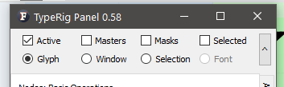
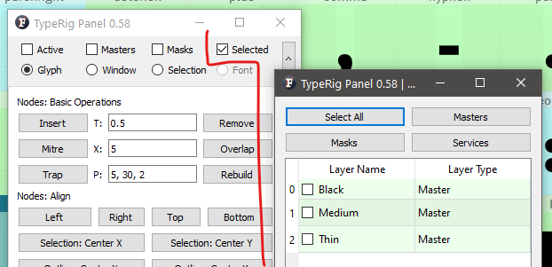
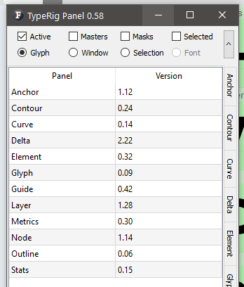

# TypeRig GUI 

## Overview
The GUI part of TypeRig consist of two basic types: sub-panels (tabs) and grouping panels (tabbed widgets). Each individual sub-panel is centered around performing specific task(s) and can be run in standalone mode. Grouping panels combine several sub-panels based around parts of type design process that usually are performed together (drawing, metrics, kerning, font management and etc) and offer some additional (refined) functionality. 

_A typical view of TR Panel showing Nodes sub-panel_

Each grouping panel takes its sub-panels from folder bearing the same name. If you want to disable some sub-panel from being loaded just add underscore to its file name (ex. _mysubpanel.py). The sub-panel will still be available as standalone app, but will no longer appear in its grouping panel.

## Panel masthead
Each grouping panel has two distinct features - a masthead and a tail. 

_A grouping panel masthead_

The masthead will show several options. First row is all about the layers that you want to work with and the second represents the glyphs you want to process.

**Layers row** includes the following options _(check-boxes)_:
- **Active**: Will perform actions only on layer that is currently active in Glyph window (GW), Font Window (FW) or any other FL window that allows character/glyph to be selected;
- **Masters**: Will process all of the glyph's masters (Again!... think of glyphs masters and not font masters as a glyph might have more or less masters than the font itself);
- **Masks**: Will process all of the glyph's mask layers;
- **Selected**: Will bring a pop-up window allowing you to select individual layers you want to process.

_Layer row with Selected option clicked_

**Glyphs row** includes the following options _(radio buttons)_:
- **Glyph**: Will perform actions only on a single Glyph that is active or selected in GW, FW or any other FL window that allows character/glyph to be selected;
- **Window**: Will perform actions in all glyphs in current active Text Window (TW); _Have in mind that any window that offers text to be entered could be considered as TW thus GW is actually a TW._
- **Selection**: Will take all of the selected glyphs in FW;
- **Font**: Is self explanatory. _(It is disabled for safety reasons)_

**Important note**: Each individual sub-panel that can be run as a standalone app performs its actions **always on all available layers for a single glyph**! If you want to work on single layer, selected layers, multiple glyphs and etc. you need to run a grouping panel that contains your desired sub-panel.

## Panel tail
Is the last tab marked by three dots (...). It contains useful information about sub-panel versions and in future will allow activating and deactivating specific panels as well as auto-update options, configuration and etc.

_A grouping panel tail_

**Panel development notes**
- Stability: High - no known major issues, but please **run any panel with a font file open!**
- Development priority: Very low - not likely to be changed often.
- Future improvements: Configuration, auto-update, panel activation/deactivation and etc.