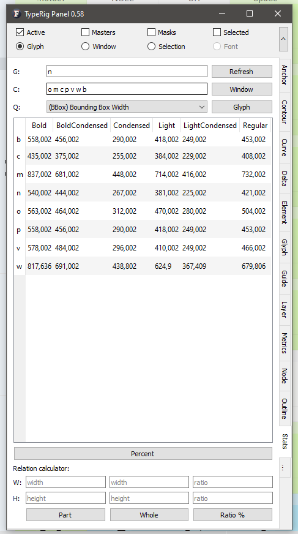
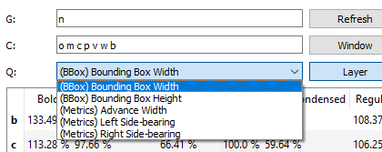
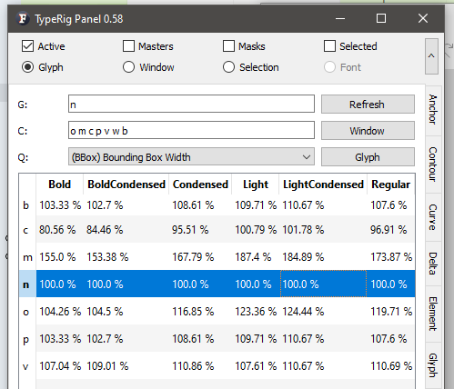
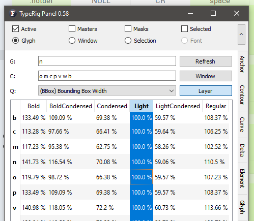
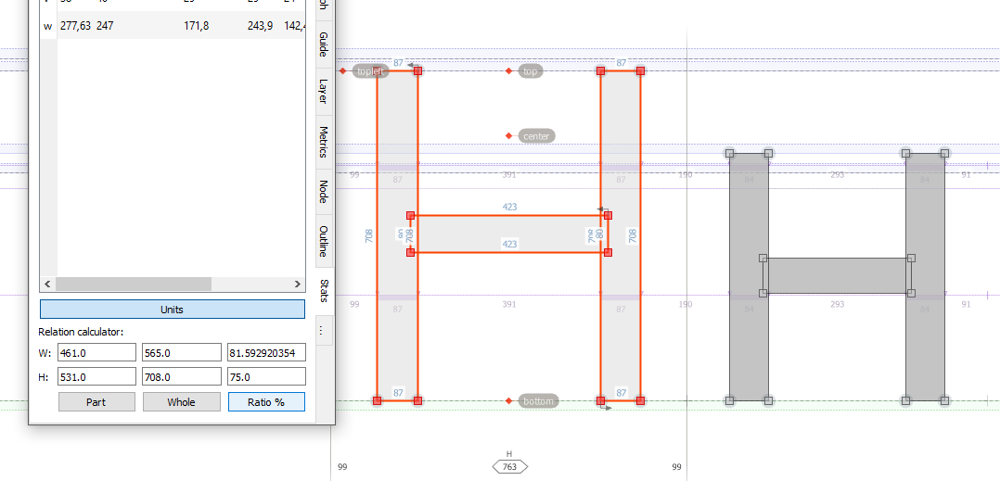

# TypeRig GUI 

## TypeRig Panel

### Statistics Panel
The Statistics tab/subpanel is a special purpose tool for simple spreadsheet style numerical analysis of multiple glyphs and their relations. It works in Glyph Window (GW) as well as Font Window (FW) and its actions are **independent** from [TypeRig panel masthead (MH)](https://kateliev.github.io/TypeRig/Docs/GUI/TR-Panel-Basics).  

_A typical view of Statistics panel_

Use _Refresh button_ when moving onto another glyph. _Warning: Trying to refresh the panel on a different font that the one it has been initially started on, might result a FL crash. This is a known issue, that will be fixed, but until then, please start different Stats panel for every new typeface you have open in FL._

On the top of the panel reside two editing fields, one for the current glyph _(G)_ and one taking a SPACE separated list of glyph names _(C)_. Also clicking on the _Window_ button next to the _C_ field will take all glyphs that are currently displayed on any active Glyph or Text window. 

_Query combo box options_

There is also a Query combo box _(Q)_ showing different options for comparing the glyphs selected. Next to the query combo resides a toggle button that switches the method of analysis. By default it reads _Glyph_ and has a second state _Layer_. 

_Comparison by glyph (row mode)_

Below sits the glyph analysis table. Upon clicking on any row of the glyph table with _Glyph_ mode active the table will take the selected row as a basis and will display the deviation in percent* (or units*) from that glyph for every glyph in the table. This is done layer by layer comparing each matching layer for every glyph. Very useful for keeping track of your glyph proportions compared to a standard measure (/H /O /n /o and etc..) or for taking proportions from an existing font.

_Comparison by layer (column mode)_

If the toggle button is switched to _Layer_ mode - clicking on any column will take that column (glyph layer) as basis and show the deviation of other layers compared to it. Useful for observing advance growth, LSB, RSB deviations and etc.

_Comparison by glyph with Units mode active_

*Below the table resides a button that switches between _Percent_ and _Units_.

At the bottom of the Statistics panel sits a small independent tool for quick comparison of outline and feature of interest - whole outline _(imagine a SMCP in comparison with an uppercase glyph)_, a stem, a serif and etc. It can be used for calculating any ratio. In Glyph Window select anything you consider a part of something and click _Part_ button. Then select any other outline or feature that you consider _Whole_. Finally click on _Ratio %_ button and you will get the difference between the above mentioned in width and height.

_Ratio calculator at the bottom of Stats panel_

**Panel development notes**
- Stability: Normal - no known major issues, except the above warning!
- Development priority: Very low - not likely to be changed often.
- Future improvements: Adding more methods of analysis if needed.
