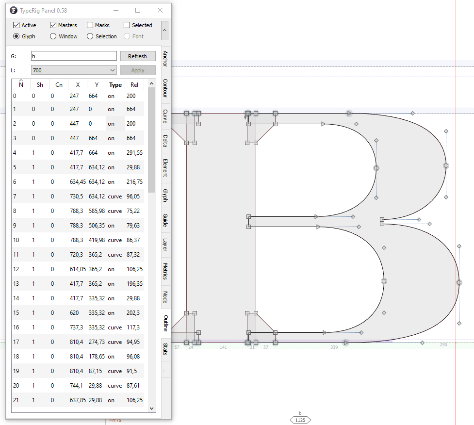

# TypeRig GUI 

## TypeRig Panel

### Outline Panel
The Outline tab/subpanel is a special purpose tool for spreadsheet style numerical editing of the glyphs outline. The panel was inspired by similar tool found in DTL Foundry Master.

_A typical view of Outline panel_

It works in Glyph Window (GW) as well as Font Window (FW) and its actions are **independent** from [TypeRig panel masthead (MH)](https://kateliev.github.io/TypeRig/Docs/GUI/TR-Panel-Basics). Use _Refresh button_ when moving onto another glyph. Trying to apply any action onto different glyph than the one shown will discard that action, rise a warning and refresh the panel. 

In its essence the panel is nothing more than a big node table representing:
- **Node index:** Not editable;
- **Shape*** **index**: Not editable; 
- **Contour index**: Not editable**;
- **X coordinate**: Editable;
- **Y coordinate**: Editable;
- **Node type**: Not editable**;
- **Relative distance to next node**: Not editable**.

_Notes:_
_* Shapes are now called Elements in FL;_
_** Making these fields editable is planned for future versions;_

All of the above columns are user sortable. On top of the node table resides a combo-box that allows switching between glyphs master layers. 

The tool is useful in fast numerical editing of node positions, observing coordinate rounding, finding inconsistencies of ink-traps, serif widths and etc.

**Panel development notes**
- Stability: Normal - no known major issues. Might be confused and misinterpret data of referenced elements, but that is not it's intended use anyway...
- Development priority: Very low - not likely to be changed often.
- Future improvements: Making as much fields editable as possible. Fix problems with element references.
