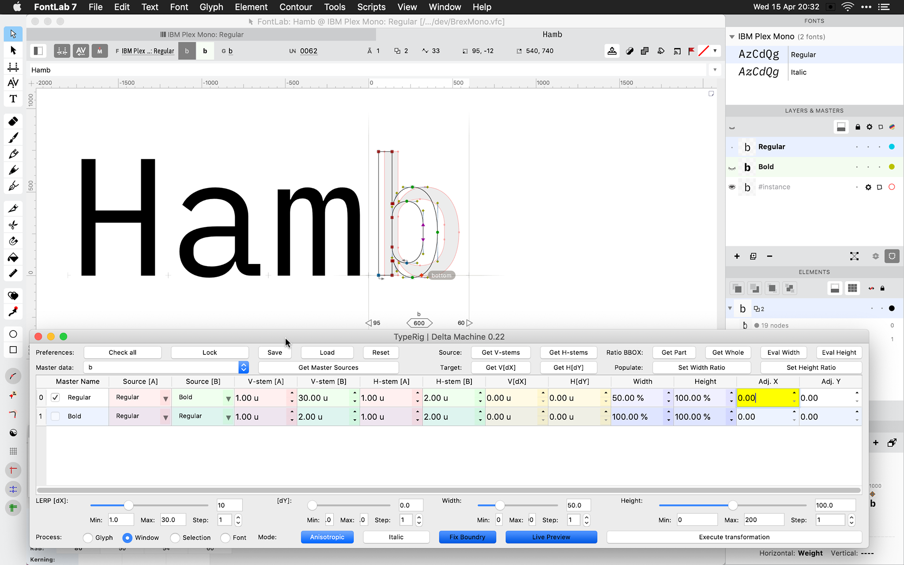
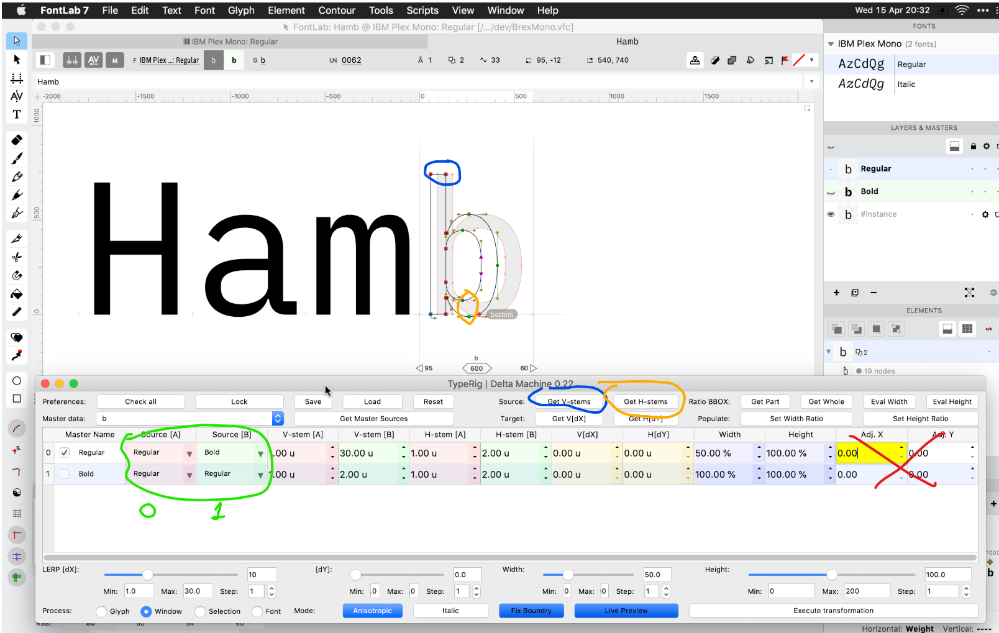
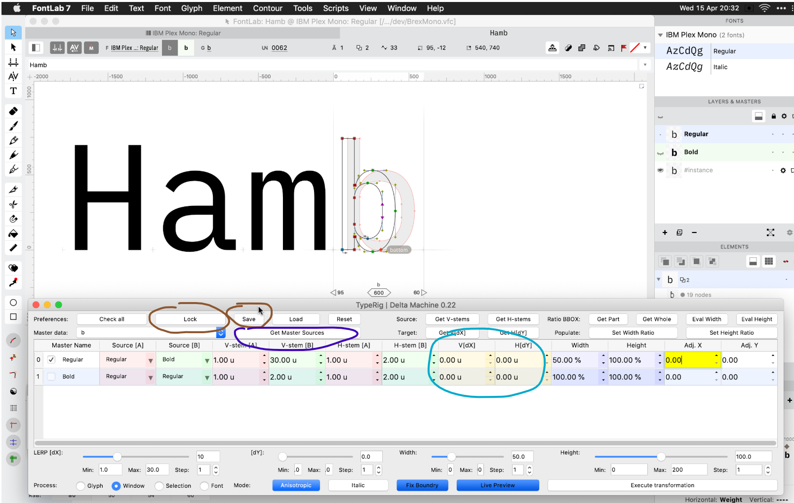
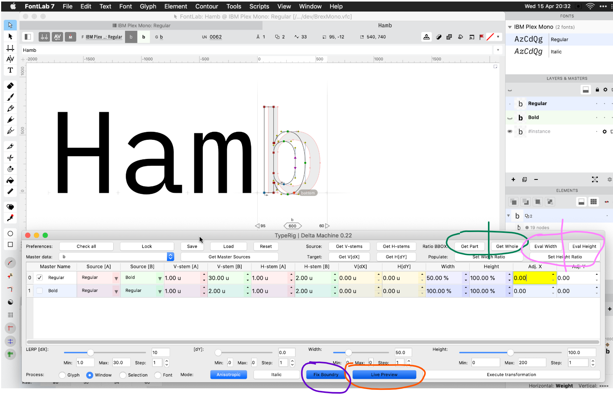

# Delta Machine

## Quick start

Let’s say you have a font with 2 masters: Regular and Bold.

In Font Info, add a Width axis and duplicate the masters so you have 4 masters (Regular, Bold, Condensed, and Bold Condensed), or at least duplicate the Regular master and call it Condensed (the variation model in FontLab 7 and in variable fonts will extrapolate Bold Condensed automatically).

_Note: This image only shows two masters, and the operations are done directly on Regular_

### Set up master info

(Green marker) In Source[A] (cell with red background) and Source[B] (cell with green background), set up the DM axes by selecting the masters. These are not FontLab axes — DM allows you to perform the compensating scaling between any two masters (A and B in the DM UI). In this example, we pick Regular–Bold and then again Regular–Bold.

In Master Data, pick a glyph.

(Blue marker) Then select two nodes that define a vertical stem distance and click Get V-stems.

(Yellow marker) Then select two nodes that define a horizontal stem and click Get H-stems.

Cells with red and green background are stem info sources for the A and B source masters.

Adj. X and Adj. Y control the ratio between compensating and normal interpolation.

### Set the desired transformation

The first column with the checkbox is the target master into which the transformation will be done.

(Cyan marker) In V[dX] and H[dY], set the desired Stem widths.

Cells with blue background are the target size adjustments. Cells with yellow background are weight adjustments.

(Brown marker) Save and lock, this is just a UI necessity for now.

(Purple marker) For every glyph you want to modify, use Get master sources.

Click Execute Transformation to actually apply the transformation using the data in the table.

### Other info

#### Reusing data

The green and pink markers: Let’s say you are making smcp, and you already have one or two of those. Let’s say you have /H and /H.smcp (already drawn), then go to /H.smcp, select all nodes and hit Get Part. Then go to /H and select all and click Get Whole. Then click pink to get the scaling percent for every layer – it will populte the table for you. If you do it with Shift pressed it will reverse Part to Whole (scaling in the opposite direction). Play with it to get the feeling.

#### Live preview

The sliders are the bottom are preview experimentation.

(Red marker) Live Preview is little bit buggy. You have to have Live Preview pressed and the row of the target selected for it to work.

#### Special "debug" setting

(Purple marker) Fix boundry: the math for the compensating scaler has a limitation, and Fix boundry aims to correct that. For example in the Regular–Bold DM axis, if you start approaching Bold, the closer you get, some math flies to infinity. The easiest way to solve it is to just "hack" the stem values +1, so the Fix boundry toggle does this. If it is pressed and you are modifying the Bold master on the Regular–Bold DM axis, if the math starts to fly off, it will add +1 to the target stem.

### Metrics

Delta Machine does not transform glyph metrics. You should bind the sidebearings or use expressions or perform metrics transformations using Tools > Actions instead.

